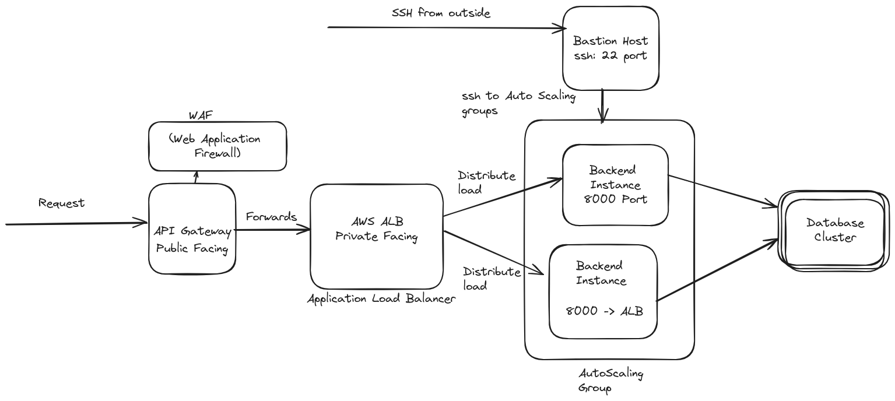

Run `docker-compose up --build` for quick deployment

Base URL: **http://localhost:8000**

## AWS Architecture!


## Patient Endpoints

**POST** `/api/v1/patients/`
Create a new patient record.

#### Request Body

```json
{
  "first_name": "John",
  "last_name": "Doe",
  "date_of_birth": "1980-01-01",
  "email": "john.doe@example.com",
  "phone": "123-456-7890",
  "diseases": {
    "Major": "Cough"
  }
}
```

**GET** `/api/v1/patients/`
Get all patient records.

**PATCH** `/api/v1/patients/{id}`
Update a patient record.

#### Request Body

```json
{
  "first_name": "Honey",
  "last_name": "Doee"
}
```

**DELETE** `/api/v1/patients/{id}`
Delete a patient record.

## Doctor's Endpoints

**POST** `/api/v1/doctors/`
Create a new doctor

#### Request Body

```json
{
  "first_name": "John",
  "last_name": "Doe",
  "date_of_birth": "1980-01-01",
  "email": "john.doe@example.com",
  "phone": "123-456-7890",
  "specialization": {
    "primary": "Cardiology",
    "secondary": ["Pediatrics", "General Medicine"]
  },
  "registration_body": "Medical Board",
  "registration_number": "MB123456",
  "registration_year": 2005
}
```

**GET** `/api/v1/doctors/`
Get all doctors

**PATCH** `/api/v1/doctors/{id}`
Update a doctor

#### Request Body

```json
{
  "first_name": "Johnn",
  "last_name": "Cena"
}
```

**DELETE** `/api/v1/doctors/{id}`
Delete a doctor record.

## Availability Setting for a doctor

**POST** `/api/v1/availabilities/`
Create an availability for a doctor

#### Request Body

```json
{
  "doctor_id": 1,
  "booking_dates": ["2024-06-19", "2024-06-19"],
  "booking_times": ["16:00", "18:00"]
}
```

## Appointment for a doctor

**POST** `/api/v1/appointments/`
Create an appointment for a patient

#### Request Body

```json
{
  "doctor": 1,
  "patient": 2,
  "appointment_date": "2024-06-19",
  "appointment_time": "17:00"
}
```
**GET** `/api/v1/appointments/upcoming_appointments/?doctor_id={id}/`
Upcoming appointments for a doctor with id: {id}

**GET** `/api/v1/appointments/`
Get all appointments

**DELETE** `/api/v1/appointments/{id}`
Delete an appointment


## Consultation for an appointment

**POST** `/api/v1/consultations/`
Create a consultations for an appointment

#### Request Body

```json
{
    "appointment": 1, 
    "type": "suggestion",
    "notes": "A demo note for the patient"
}
```
**GET** `/api/v1/consultations/?appointment_id={id}`
Consultation for a specfic appointment with id: {id}

**GET** `/api/v1/consultations/`
Get all consultations

**DELETE** `/api/v1/consultations/{id}`
Delete a consultations


**PATCH** `/api/v1/consultations/{id}`
Update a consultation
```json
{
    "notes": "A demo note for the patient"
}
```